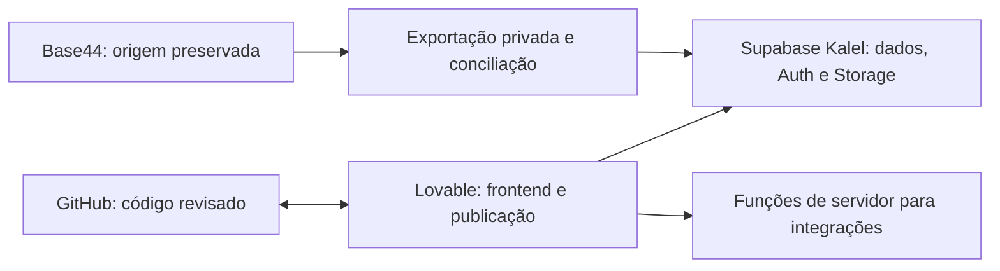

# Plano de migração — J&T Gomes Construtora

Atualizado em 02/10/2026. Este documento orienta a execução e registra o que já foi comprovado. Etapas dependentes de acesso externo permanecem pendentes até que haja evidência de conclusão.

**Entrega para revisão:** [PR #1, em rascunho](https://github.com/jeanpg93-tech/jt-gomes-construtora/pull/1), branch `codex/migracao-supabase-completa`. Código preparado e ensaio local aprovados; main continua preservada. A carga não foi aplicada no Supabase remoto e o frontend ainda não foi transferido para Lovable.

## Objetivo e decisões confirmadas

Migrar o sistema do Base44 para Lovable, reaproveitando as telas e os cálculos existentes, com banco, autenticação e arquivos em um projeto Supabase externo da conta **Kalel**, organização `ndflqyfhnwhjqbhmwnxy`, plano **Free**. Região proposta: São Paulo (`sa-east-1`).

- Lovable: workspace **Jean's Lovable** (`IvIF4jdxlCtwKNlHNCrM`), escolhido pelo usuário.
- Primeiro administrador: email confirmado na conversa e mantido no registro privado de execução. A promoção depende da criação e confirmação dessa conta no Supabase Auth.
- O usuário informou que o Base44 não recebe lançamentos novos desde o backup. Conferir novamente esse estado antes do corte.
- Origem identificada pelo nome no repositório, pela URL da foto e pelos IDs/totais: **J&T GOMES CONSTRUTORA (Copy) (Copy)**, app `68e9048368479eb97b630e22`. Existem outras cinco cópias; toda consulta e exportação deve usar este ID. Se o usuário indicar outra cópia como a utilizada, refazer o inventário antes de importar.
- Frontend atual: React 18, Vite 6, JSX, Tailwind, shadcn/ui. Preservar interface, rotas, regras financeiras e precisão numérica. Qualquer adaptação de stack exigida pelo Lovable precisa de uma comparação funcional antes da transferência definitiva.
- Lovable criado para preparação: https://lovable.dev/projects/55f35ed3-f5d6-42e7-8256-451331bc8531. A criação não equivale à transferência do código nem à publicação.

## Arquitetura pretendida

Um único banco externo atende ao frontend. Senhas, tokens e chaves secretas permanecem no servidor. O navegador usa somente a URL e a chave pública do Supabase. Backups de dados não são assets do site. O ambiente de desenvolvimento, o projeto Supabase e a publicação do app são operações distintas.

## Inventário comprovado e lacunas do backup antigo

O pacote de 26/09/2026 contém apenas oito entidades. Uma nova leitura em 02/10/2026 preservou 19 entidades, com **468 registros**, incluindo dois perfis de usuário com campos explicitamente selecionados, sem senhas ou sessões.

| Módulo/entidade | Na origem consultada | No pacote antigo | Tratamento |
|---|---:|---:|---|
| Obras | 3 | 3 | Preservar IDs e campos |
| Gastos de obras | 263 | 263 | Comparar todos os campos e totais |
| Categorias de gasto | 15 | 15 | Comparar campos e referências |
| Subcategorias de gasto | 34 | 34 | Preservar referências |
| Contratos | 1 | 1 | Preservar vínculos e arquivos |
| Fornecedores | 51 | Ausentes | Recuperados; 26 sem tipo PF/PJ |
| Parcelas | 41 | Ausentes | Recuperadas; 11 com referência sem gasto |
| Gastos administrativos | 25 | Ausentes | Recuperados; total próprio |
| Categorias administrativas | 14 | Ausentes | Recuperadas |
| Etapas de obra | 17 | Ausentes | Recuperadas |
| Pessoas | 1 | Ausente | Recuperada |
| Recibos | 1 | Ausente | Recuperado |
| Usuários/configurações | 2 | Ausentes | Recriar Auth; mapear perfis por email confirmado |
| Receitas, categorias de receita, subcategorias 2, materiais, materiais/etapas, solicitações | 0 | Algumas vazias; outras ausentes | Conferir que continuam vazias; manter estrutura |

Totais conferidos com precisão decimal e registrados nos relatórios privados de auditoria e ensaio em `/workspace/cloud-setup/jt-gomes-construtora/`. Parcelas e recibos não devem ser somados automaticamente ao total de gastos. O relatório distingue valores de origem, operacionais e pendentes de conciliação.

Há diferenças em campos exportados de oito gastos e uma categoria entre o pacote antigo e a origem, mesmo com IDs e totais iguais. A diferença não comprova lançamento novo depois de 26/09. Comparar e registrar qual versão de cada campo será usada; não assumir equivalência completa com base no total financeiro.

## Etapa 1 — Preservação, inventário e conciliação

**Estado:** inventário e cópia privada completos; ensaio preserva todos os campos dos 468 registros. Conciliação das 11 parcelas pendente; os 26 fornecedores incompletos são aceitos sem classificação automática e sinalizados no formulário.

1. Preservar o checkout modificado, o pacote original e um patch recuperável. Não reinstalar um checkout sobre as alterações locais.
2. Guardar a exportação atual separadamente, com ID da origem, data, contagens e SHA-256 de cada arquivo. A cópia atual fica fora do repositório, em `/workspace/cloud-setup/jt-gomes-construtora/source-snapshot-20261002/`.
3. Conferir todos os campos, IDs, referências, enumerações, valores monetários, datas e campos obrigatórios contra o banco de destino. Preservar metadados Base44 sem transformá-los em privilégios Supabase.
4. Tratar os **26 fornecedores sem tipo** como cadastros incompletos. Não inferir PF/PJ pelo nome. A opção técnica preferida é aceitar o tipo ausente no legado, identificá-lo na interface e exigir classificação nas futuras edições pertinentes. Registrar explicitamente qualquer alteração de schema necessária.
5. Conciliar **11 parcelas ligadas a dois gastos ausentes**. Verificar exclusões e referências na origem. Preservar integralmente esses registros numa área privada de conciliação até definir o vínculo correto. Não fabricar gastos, apagar parcelas ou remover silenciosamente a integridade referencial.
6. Conciliar os campos divergentes entre as duas exportações e registrar as transformações permitidas, como string vazia em uma referência opcional para NULL.

**Critério de aceite:** todos os registros têm destino documentado; todas as divergências estão resolvidas ou preservadas numa área de conciliação identificada, com decisão explícita sobre o efeito financeiro. Não declarar os 468 registros importados só porque os 263 gastos foram importados.

## Etapa 2 — Supabase externo e banco completo

**Estado:** organização Free acessível; projeto ainda não criado. Importador completo implementado e validado localmente.

1. Criar `jt-gomes-construtora` na organização Kalel, região São Paulo, mantendo o plano Free. Verificar capacidade e limites; não contratar plano ou recurso pago para contornar um bloqueio.
2. Revisar a migração preparada com 19 tabelas, índices, referências, políticas de acesso e bucket privado `documentos`. Aplicar a versão revisada uma única vez num banco vazio; `schema.sql` e a migration atual representam a mesma mudança e não devem ser executados em duplicidade.
3. Usar `import_snapshot.py` para a exportação completa: valida o manifesto, importa pais antes dos filhos, preserva IDs e precisão decimal, detecta conflitos e executa a carga numa transação. O script `import_data.py` cobre apenas o pacote antigo. A versão completa bloqueia vínculos inválidos por padrão; `--allow-reconciliation` permite somente ensaio com preservação dos registros pendentes no arquivo privado. Perfis Auth são tratados separadamente.
4. Preservar campos Base44 não operacionais em arquivo de auditoria privado; não descartar campos sem informar o motivo. Datas de criação e atualização não devem mudar silenciosamente durante a carga.
5. Importar e conferir registros por tabela, conjuntos de IDs, campos relevantes, totais por obra, categorias e status de pagamento, gastos administrativos e parcelas. Testar repetição compatível e cancelamento integral em conflito.
6. Rodar os advisors de segurança/performance e consultas de verificação no banco real. Registrar resultados e limitações.

**Critério de aceite:** carga completa conciliada, contagens e IDs conferidos, totais exatos, nenhuma relação inválida escondida e regras de acesso verificadas no serviço real. A suite local sozinha não cumpre essa etapa.

## Etapa 3 — Autenticação, acesso e arquivos

**Estado:** código local preparado; validação remota pendente.

1. Configurar `VITE_SUPABASE_URL` e `VITE_SUPABASE_PUBLISHABLE_KEY`. Configurar somente o domínio real necessário na rede do ambiente; o estado atual não permite presumir acesso HTTP ao novo projeto.
2. Criar a conta do administrador confirmado pelo fluxo de cadastro, confirmar o email e promover apenas o UUID correto a administrador. Recriar o outro usuário quando a identidade e o acesso forem confirmados. Não migrar IDs Base44 como UUIDs Auth nem usar senhas inventadas.
3. Mapear os dados empresariais e de perfil exportados para os novos usuários. Conferir logo, dados da construtora, representante e configurações usadas por contratos e recibos.
4. Revisar a matriz de permissões por módulo e o escopo dos registros. A origem restringe alguns módulos por criador/admin; o código preparado usa permissões por módulo. Essa diferença precisa ser resolvida antes de liberar contas comuns. A opção de ocultar valores não pode ser tratada como isolamento no banco sem regras que o garantam.
5. Testar visitante, conta sem confirmação, conta aguardando aprovação, usuário de leitura, editor e administrador. Conferir leitura, criação, atualização, exclusão, auto-promoção negada e revogação de acesso.
6. Configurar Site URL, redirects de Auth e confirmação de email para a URL real. Verificar entrega dos emails no serviço escolhido e limites do plano.
7. Migrar foto, logo e anexos dependentes do Base44 para Storage privado. Conferir bytes e abertura pelo app; usar referências estáveis e URLs assinadas. Testar visitante bloqueado, upload permitido, exclusão e substituição de arquivos conforme as políticas.

**Critério de aceite:** administrador confirmado, usuários com escopo correto, nenhum dado financeiro acessível sem autorização e arquivos utilizados sem depender do domínio Base44.

## Etapa 4 — Transferência do código para GitHub/Lovable

**Estado:** projeto Lovable criado para preparação; código de origem preservado em branch e PR de rascunho. Conexão GitHub pela interface e transferência do frontend pendentes.

1. Confirmar o fluxo suportado pelo projeto Lovable para receber o frontend existente. Não presumir importação automática de um repositório pelo recurso Connect GitHub.
2. Conectar o projeto Lovable ao GitHub usando a conta correta. Se o Lovable criar um repositório próprio, copiar o código revisado para esse destino em uma branch e PR, preservando os arquivos de configuração requeridos pela plataforma.
3. O repositório de origem é público e contém o pacote antigo de dados. A transferência para Lovable deve levar código, documentação e testes, sem copiar backups reais, CSVs, configurações empresariais exportadas ou credenciais. Testes distribuídos com o código devem usar fixtures sintéticas quando precisarem de dados.
4. Preservar o trabalho de origem em branch/PR e evitar alterações diretas em main. Não sincronizar simultaneamente dois destinos que possam sobrescrever o código. Documentar qual repositório passa a ser a fonte do frontend.
5. Conectar o mesmo Supabase externo Kalel. Não habilitar um segundo banco pelo Lovable Cloud.
6. O template criado foi conferido pelo `package.json` do commit `4a1cd99d05096fdc07aaf8594d1b8d3becec65c1`: **TanStack Start 1.168.60, React 19.2, Vite 8.1.5, Tailwind 4.2.1**. Adaptar entrada, roteamento e compatibilidade com esse destino, preservando o frontend original no checkout de origem. A resposta inicial do agente Lovable mencionou Vite 7; prevalece a versão verificada no arquivo.
7. Preservar as 16 rotas de `src/pages.config.js`, a rota `/login`, os parâmetros de consulta e os links de contratos/relatórios. Substituir React Router pela integração suportada no destino; testar autenticação e redirecionamentos antes de transferir todas as telas.
8. Revisar uso de `window`, `document`, `localStorage`, downloads e geração de PDF no contexto de renderização do servidor. Executar essas operações no navegador e impedir compartilhamento de sessão entre requisições no servidor. Supabase Edge Functions continuam sendo uma opção de backend externo; não há necessidade comprovada de reescrevê-las no runtime Lovable.
9. Conferir compatibilidade de calendário, formulários, gráficos, PDF, mapas e componentes que mudaram de versão. Preservar estilos/Tailwind e adaptar APIs de componentes com comparação visual e funcional. Não substituir cálculos e componentes por aproximações geradas.
10. Validar instalação, build, preview, rotas profundas e variáveis públicas/servidor. Preservar o `AGENTS.md` do destino, que orienta manter histórico publicado sem force-push/rebase/amend/squash e manter a branch sincronizada em estado funcional.

**Critério de aceite:** código migrado disponível no destino correto, preview reproduzível, banco externo correto, nenhuma incorporação de dados privados ao build e sincronização GitHub verificada.

## Etapa 5 — Homologação e integrações

**Estado:** pendente do projeto remoto e da transferência.

| Fluxo | O que comprovar |
|---|---|
| Dashboard e relatórios | Totais por obra/status/categoria iguais à base conciliada; arquivos exportados corretos |
| Obras | Cadastro, edição, filtros, áreas, previsão, vendas e foto |
| Gastos e parcelas | Datas, baixas, vencimentos, recorrência, entrada, edição e exclusão permitida; sem duplicar despesas |
| Gastos administrativos | Total separado e filtros/baixas corretos |
| Receitas | Cadastro e status com registro de teste, sem inventar receita histórica |
| Fornecedores/pessoas | Campos completos, legados incompletos identificados e vínculos preservados |
| Contratos/recibos | Beneficiários, valores, dados empresariais, geração e abertura de documentos |
| Configurações/usuários | Efeito das alterações, aprovação/negação e bloqueio de permissões insuficientes |
| Celular e navegação | Formulários utilizáveis, atualização de páginas e rotas profundas |

Criar somente registros de teste identificados e remover apenas esses registros. Repetir checks quando houver mudança, falha ou preocupação não resolvida; evitar ampliar testes sem motivo depois de uma versão aprovada.

Integrações exigem execução e configuração próprias:

- **WhatsApp:** mapear os comandos/agente existentes, escolher o provedor autorizado, recriar webhooks e funções, autenticar chamadas, impedir duplicação e conferir criação/consulta de lançamentos de acordo com as permissões. Provedor e conexão do número ainda pendentes.
- **IA/API:** levantar o contrato usado por clientes existentes; criar endpoint de servidor e autenticação apropriada, validar dados, registrar erros e testar consumidores. Não copiar chaves estáticas para o frontend.
- **Emails personalizados:** escolher serviço/SMTP, guardar credenciais no servidor e testar os eventos de aprovação/negação com destinatários autorizados. Cadastro/confirmacão de email no Auth é um fluxo separado.

**Critério de aceite:** todos os fluxos do escopo escolhido operam no serviço real. Uma tela informando que uma integração está pendente não comprova que a integração foi migrada. A troca de sistema depende da definição e aceitação do efeito dessas pendências.

## Etapa 6 — Corte, retorno e acompanhamento

**Estado:** pendente da homologação.

1. Apresentar a versão candidata, URL, testes, contagens, totais e pendências ao usuário. Confirmar os usuários e os fluxos necessários para o uso cotidiano.
2. Conferir se a origem permanece sem escrita. Registrar o instante do corte e gerar/exportar a versão final com hashes e contagens. Se houve escrita, conciliar novos, alterados e excluídos antes do corte; o importador antigo não é sincronização incremental.
3. Gerar backup privado do destino antes da liberação. Na organização Free, verificar quais opções de restauração realmente estão disponíveis e manter exportação própria validada; não presumir PITR ou backups pagos.
4. Publicar a versão homologada, configurar domínio/URL e testar login, redirects, rotas profundas, permissões e relatórios na URL publicada.
5. Passar a usar um único sistema para gravações. Manter o Base44 como referência durante o período de transição acordado. Revogar webhooks/chaves antigos e encerrar recursos antigos somente depois da confirmação de estabilidade e preservação dos dados.
6. Acompanhar erros de Auth, funções, relatórios, emails e Storage nos primeiros dias. Definir responsáveis por acesso, backups e correção de incidentes.

**Retorno:** antes de qualquer gravação no novo sistema, retornar o acesso ao Base44 preservado e à versão anterior do frontend. Se houver gravações no destino, primeiro suspender novas escritas, exportar e conciliar esses registros; não perder lançamentos ao trocar o link. Reverter código não equivale a reverter dados.

**Critério de aceite final:** uso confirmado na URL nova, dados conciliados, fluxos necessários disponíveis, backup recuperável, origem preservada durante a transição e plano de retorno executável.

## Sequência e responsabilidades

Etapa 1 e preparação do Supabase/Lovable podem avançar independentemente. A carga final depende da conciliação; a homologação depende de banco/Auth/código conectados; a publicação para uso depende da homologação e dos dados finais.

O agente executa preparação de código, auditorias, SQL, importação autorizada, testes e PRs. O usuário realiza login/consentimento nas contas, confirma identidade do administrador, ajuda a conciliar vínculos ausentes e verifica os fluxos do negócio. Não há prazo fixo enquanto houver dependências de plataforma, acesso e conciliação.

## Evidências e bloqueios desta execução

- Build Vite aprovado novamente em 02/10/2026; 19 testes locais aprovados, incluindo importação completa com fixtures sintéticas. A primeira execução dos testes nesta sessão encontrou restrição Node → Python; a repetição autorizada concluiu sem falha.
- Backup antigo validado; nova exportação privada de 19 entidades preservada com manifesto e hashes. Auditoria inicial em `/workspace/cloud-setup/jt-gomes-construtora/snapshot-audit.json`.
- Organização Kalel confirmada no plano Free; nenhum projeto encontrado.
- A consulta de custo exigida para criação automática retorna `MCP tool get_cost was not returned by tools/list`. Foi solicitada criação pelo painel do Supabase como alternativa. Não foram inventados ID de confirmação ou custos para acionar a criação.
- Rede do ambiente reportada como restrita; nenhuma credencial ou variável de projeto pronta. A busca do changelog por HTTP falhou no acesso ao proxy; documentação Supabase consultada pelo conector. A operação real no novo domínio ainda precisa ser validada.
- Projeto Lovable **J&T Gomes Builder** criado e confirmado como pronto para preparação, sem publicação. A resposta técnica confirmou o fluxo de repositório novo via Connect GitHub; foram conferidos o template e o `AGENTS.md` pelos arquivos do projeto. A conexão GitHub pela interface foi solicitada ao usuário. Visibilidade `workspace_edit`; tentativa de alterar para `private` retornou 422. Nenhum backup foi enviado ao Lovable.
- Lint/typecheck têm problemas preexistentes e continuam pendentes; não foram desativados para declarar sucesso.

Próximas ações concretas: obter o projeto Supabase externo; conectar GitHub pelo projeto Lovable; resolver o escopo de acesso e as parcelas pendentes; adaptar o frontend e validar o banco no serviço real antes da liberação.

## Continuação: ensaio da carga completa

O novo `import_snapshot.py` verifica os hashes e as 19 entidades, importa pais antes dos filhos, preserva todos os campos da origem em `migration_private` e prepara SQL transacional com verificação de conflitos. O arquivo privado tem RLS e acesso revogado aos papéis `anon` e `authenticated`, inclusive para administradores da aplicação. Nenhum perfil Base44 é convertido automaticamente em usuário Auth ou privilégio ativo.

O ensaio com a exportação completa preservou os **468 registros** e colocou **455 registros** nas tabelas operacionais. As **11 parcelas sem vínculo** permanecem no arquivo privado para conciliação; os **2 perfis** permanecem pendentes da recriação de identidade. Das 41 parcelas, 30 possuem vínculo válido. Os totais operacionais e pendentes estão no relatório privado; os registros não foram apagados ou somados a outros módulos.

Os 51 fornecedores entram com seus dados existentes. Os 26 sem tipo mantêm `tipo = NULL`, com aviso no cadastro e seleção explícita ao editar o formulário completo. Campos vazios de data/enumeração/referência são normalizados para NULL no destino, mantendo o valor original no arquivo privado e registrando as contagens dessas normalizações no relatório.

Validação local: totais financeiros, campos originais, repetição sem duplicação e bloqueio do arquivo privado conferidos em PostgreSQL/PGlite. A carga continua sendo um ensaio; não foi aplicada em Supabase remoto e as parcelas ainda precisam de conciliação para a homologação final.
